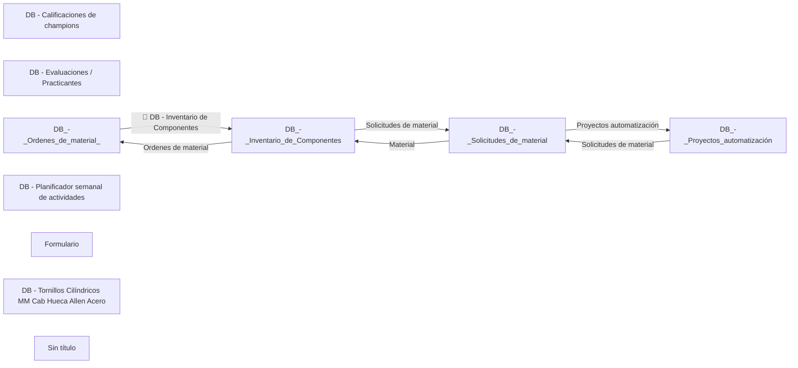

```mermaid
graph LR
    DB_-_Calificaciones_de_champions[DB - Calificaciones de champions]
    DB_-_Evaluaciones_/_Practicantes[DB - Evaluaciones / Practicantes]
    DB_-_Ordenes_de_material_ -- 🔌 DB - Inventario de Componentes --> DB_-_Inventario_de_Componentes
    DB_-_Inventario_de_Componentes -- Ordenes de material  --> DB_-_Ordenes_de_material_
    DB_-_Inventario_de_Componentes -- Solicitudes de material --> DB_-_Solicitudes_de_material
    DB_-_Solicitudes_de_material -- Material --> DB_-_Inventario_de_Componentes
    DB_-_Solicitudes_de_material -- Proyectos automatización --> DB_-_Proyectos_automatización
    DB_-_Proyectos_automatización -- Solicitudes de material --> DB_-_Solicitudes_de_material
    DB_-_Planificador_semanal_de_actividades[DB - Planificador semanal de actividades]
    Formulario[Formulario]
    DB_-_Tornillos_Cilíndricos_MM_Cab_Hueca_Allen_Acero[DB - Tornillos Cilíndricos MM Cab Hueca Allen Acero]
    Sin_título[Sin título]
```